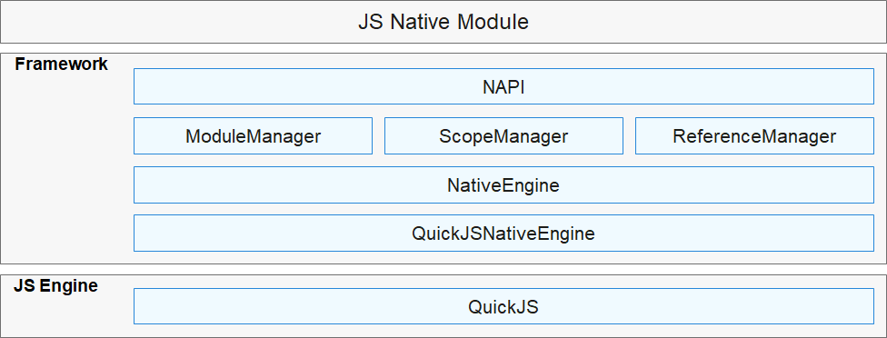

# NAPI组件<a name="ZH-CN_TOPIC_0000001149901711"></a>

-   [简介](#section11660541593)
-   [目录](#section161941989596)
-   [使用场景](#section11759141594811)
-   [接口说明](#section1611515555510)
-   [开发步骤](#section937267212)
-   [涉及仓](#section3970193518214)

## 简介<a name="section11660541593"></a>

NAPI（Native API）组件是一套对外接口基于Node.js N-API规范开发的原生模块扩展开发框架。

**图 1**  NAPI组件架构图<a name="fig1049423884819"></a>  




-   **NativeEngine**

    JS引擎抽象层，统一JS引擎在NAPI层的接口行为。

-   **ModuleManager**

    管理模块，用于模块加载、模块信息缓存。

-   **ScopeManager**

    管理NativeValue的生命周期。

-   **ReferenceManager**

    管理NativeReference的生命周期。


## 目录<a name="section161941989596"></a>

NAPI组件源代码在/foundation/ace/napi下，目录结构如下图所示：

```
foundation/ace/napi
   ├── interfaces
   │   └── kits
   │       └── napi           # NAPI头文件目录
   ├── module_manager         # 模块管理
   ├── native_engine          # NativeEngine抽象层
   │   └── impl
   │       └── quickjs        # 基于QuickJS的NativeEngine实现
   ├── scope_manager          # 作用域管理
   └── test                   # 测试目录
```

## 使用场景<a name="section11759141594811"></a>

NAPI适合封装IO、CPU密集型、OS底层等能力并对外暴露JS接口，通过NAPI可以实现JS与C/C++代码互相访问。我们可以通过NAPI接口构建例如网络通信、串口访问、多媒体解码、传感器数据收集等模块。

## 接口说明<a name="section1611515555510"></a>

接口实现详见：**foundation/ace/napi**。

**表 1**  NAPI接口说明

<a name="table10789351555"></a>
<table><thead align="left"><tr id="row1878635175515"><th class="cellrowborder" valign="top" width="19.439999999999998%" id="mcps1.2.3.1.1"><p id="p27816352556"><a name="p27816352556"></a><a name="p27816352556"></a>接口分类</p>
</th>
<th class="cellrowborder" valign="top" width="80.56%" id="mcps1.2.3.1.2"><p id="p078835105514"><a name="p078835105514"></a><a name="p078835105514"></a>描述</p>
</th>
</tr>
</thead>
<tbody><tr id="row17863535520"><td class="cellrowborder" valign="top" width="19.439999999999998%" headers="mcps1.2.3.1.1 "><p id="p678143512552"><a name="p678143512552"></a><a name="p678143512552"></a>模块注册</p>
</td>
<td class="cellrowborder" valign="top" width="80.56%" headers="mcps1.2.3.1.2 "><p id="p4781035185515"><a name="p4781035185515"></a><a name="p4781035185515"></a>向模块管理注册模块信息的接口。</p>
</td>
</tr>
<tr id="row67951538205618"><td class="cellrowborder" valign="top" width="19.439999999999998%" headers="mcps1.2.3.1.1 "><p id="p127961438195616"><a name="p127961438195616"></a><a name="p127961438195616"></a>异常&amp;错误处理</p>
</td>
<td class="cellrowborder" valign="top" width="80.56%" headers="mcps1.2.3.1.2 "><p id="p47961338195617"><a name="p47961338195617"></a><a name="p47961338195617"></a>向JS抛出异常。</p>
</td>
</tr>
<tr id="row778417510579"><td class="cellrowborder" valign="top" width="19.439999999999998%" headers="mcps1.2.3.1.1 "><p id="p1878575185715"><a name="p1878575185715"></a><a name="p1878575185715"></a>对象生命周期管理</p>
</td>
<td class="cellrowborder" valign="top" width="80.56%" headers="mcps1.2.3.1.2 "><p id="p1178565175711"><a name="p1178565175711"></a><a name="p1178565175711"></a>作用域管理，用于限定某个作用域范围内的NAPI对象的生命周期。</p>
</td>
</tr>
<tr id="row83179619572"><td class="cellrowborder" valign="top" width="19.439999999999998%" headers="mcps1.2.3.1.1 "><p id="p1531786125717"><a name="p1531786125717"></a><a name="p1531786125717"></a>创建JS对象</p>
</td>
<td class="cellrowborder" valign="top" width="80.56%" headers="mcps1.2.3.1.2 "><p id="p12317663572"><a name="p12317663572"></a><a name="p12317663572"></a>创建标准的对象类型。</p>
</td>
</tr>
<tr id="row63859616579"><td class="cellrowborder" valign="top" width="19.439999999999998%" headers="mcps1.2.3.1.1 "><p id="p438696165720"><a name="p438696165720"></a><a name="p438696165720"></a>C类型转NAPI类型</p>
</td>
<td class="cellrowborder" valign="top" width="80.56%" headers="mcps1.2.3.1.2 "><p id="p14386462570"><a name="p14386462570"></a><a name="p14386462570"></a>C到NAPI的类型转换。</p>
</td>
</tr>
<tr id="row1145119612578"><td class="cellrowborder" valign="top" width="19.439999999999998%" headers="mcps1.2.3.1.1 "><p id="p13451116115716"><a name="p13451116115716"></a><a name="p13451116115716"></a>NAPI类型转C类型</p>
</td>
<td class="cellrowborder" valign="top" width="80.56%" headers="mcps1.2.3.1.2 "><p id="p12451464574"><a name="p12451464574"></a><a name="p12451464574"></a>NAPI到C的类型转换。</p>
</td>
</tr>
<tr id="row1451436155720"><td class="cellrowborder" valign="top" width="19.439999999999998%" headers="mcps1.2.3.1.1 "><p id="p155147625713"><a name="p155147625713"></a><a name="p155147625713"></a>获取全局实例的函数</p>
</td>
<td class="cellrowborder" valign="top" width="80.56%" headers="mcps1.2.3.1.2 "><p id="p551466195713"><a name="p551466195713"></a><a name="p551466195713"></a>获取全局实例。</p>
</td>
</tr>
<tr id="row65815617579"><td class="cellrowborder" valign="top" width="19.439999999999998%" headers="mcps1.2.3.1.1 "><p id="p458119617577"><a name="p458119617577"></a><a name="p458119617577"></a>JS值的操作</p>
</td>
<td class="cellrowborder" valign="top" width="80.56%" headers="mcps1.2.3.1.2 "><p id="p125818625711"><a name="p125818625711"></a><a name="p125818625711"></a>===、typeof、instanceof等操作符的NAPI接口。</p>
</td>
</tr>
<tr id="row10649166145711"><td class="cellrowborder" valign="top" width="19.439999999999998%" headers="mcps1.2.3.1.1 "><p id="p18649196195716"><a name="p18649196195716"></a><a name="p18649196195716"></a>JS对象的属性操作</p>
</td>
<td class="cellrowborder" valign="top" width="80.56%" headers="mcps1.2.3.1.2 "><p id="p164919615574"><a name="p164919615574"></a><a name="p164919615574"></a>操作对象属性函数集。</p>
</td>
</tr>
<tr id="row0714260574"><td class="cellrowborder" valign="top" width="19.439999999999998%" headers="mcps1.2.3.1.1 "><p id="p37143675714"><a name="p37143675714"></a><a name="p37143675714"></a>JS函数的操作</p>
</td>
<td class="cellrowborder" valign="top" width="80.56%" headers="mcps1.2.3.1.2 "><p id="p771466115711"><a name="p771466115711"></a><a name="p771466115711"></a>方法调用、实例创建。</p>
</td>
</tr>
<tr id="row1578176155717"><td class="cellrowborder" valign="top" width="19.439999999999998%" headers="mcps1.2.3.1.1 "><p id="p1782126155711"><a name="p1782126155711"></a><a name="p1782126155711"></a>对象封装</p>
</td>
<td class="cellrowborder" valign="top" width="80.56%" headers="mcps1.2.3.1.2 "><p id="p87821967572"><a name="p87821967572"></a><a name="p87821967572"></a>绑定JS对象的外部上下文关系。</p>
</td>
</tr>
<tr id="row8854116105717"><td class="cellrowborder" valign="top" width="19.439999999999998%" headers="mcps1.2.3.1.1 "><p id="p1685414619578"><a name="p1685414619578"></a><a name="p1685414619578"></a>简单异步</p>
</td>
<td class="cellrowborder" valign="top" width="80.56%" headers="mcps1.2.3.1.2 "><p id="p1685411612574"><a name="p1685411612574"></a><a name="p1685411612574"></a>创建异步任务。</p>
</td>
</tr>
<tr id="row109154635718"><td class="cellrowborder" valign="top" width="19.439999999999998%" headers="mcps1.2.3.1.1 "><p id="p391556195720"><a name="p391556195720"></a><a name="p391556195720"></a>promise</p>
</td>
<td class="cellrowborder" valign="top" width="80.56%" headers="mcps1.2.3.1.2 "><p id="p1091566135717"><a name="p1091566135717"></a><a name="p1091566135717"></a>创建promise对象的函数集。</p>
</td>
</tr>
<tr id="row1671493313016"><td class="cellrowborder" valign="top" width="19.439999999999998%" headers="mcps1.2.3.1.1 "><p id="p1971512331709"><a name="p1971512331709"></a><a name="p1971512331709"></a>脚本运行</p>
</td>
<td class="cellrowborder" valign="top" width="80.56%" headers="mcps1.2.3.1.2 "><p id="p371517332013"><a name="p371517332013"></a><a name="p371517332013"></a>运行JS代码。</p>
</td>
</tr>
</tbody>
</table>

## 开发步骤<a name="section937267212"></a>

下面以开发一个获取应用包名的JS接口为例介绍如何使用NAPI。

我们要实现的JS接口原型是：

```
function getAppName(): string;
```

以下是实现源码：

```
// app.cpp
#include <stdio.h>
#include <string.h>
#include "napi/native_api.h"
#include "napi/native_node_api.h"

struct AsyncCallbackInfo {
    napi_env env;
    napi_async_work asyncWork;
    napi_deferred deferred;
};

// getAppName对应的C/C++实现函数
napi_value JSGetAppName(napi_env env, napi_callback_info info) {
    napi_deferred deferred;
    napi_value promise;
    // 创建promise
    NAPI_CALL(env, napi_create_promise(env, &deferred, &promise));

    AsyncCallbackInfo* asyncCallbackInfo = new AsyncCallbackInfo {
        .env = env,
        .asyncWork = nullptr,
        .deferred = deferred,
    };

    napi_value resourceName;
    napi_create_string_latin1(env, "GetAppName", NAPI_AUTO_LENGTH, &resourceName);
    // 创建异步任务队列
    napi_create_async_work(
        env, nullptr, resourceName,
        // 异步任务的回调
        [](napi_env env, void* data) {},
        // 异步任务结束后的回调
        [](napi_env env, napi_status status, void* data) {
            AsyncCallbackInfo* asyncCallbackInfo = (AsyncCallbackInfo*)data;
            napi_value appName;
            const char* str = "com.example.helloworld";
            napi_create_string_utf8(env, str, strlen(str), &appName);
            // 触发回调
            napi_resolve_deferred(asyncCallbackInfo->env, asyncCallbackInfo->deferred, appName);
            napi_delete_async_work(env, asyncCallbackInfo->asyncWork);
            delete asyncCallbackInfo;
        },
        (void*)asyncCallbackInfo, &asyncCallbackInfo->asyncWork);
    napi_queue_async_work(env, asyncCallbackInfo->asyncWork);
    return promise;
}

// 模块导出入口函数
static napi_value AppExport(napi_env env, napi_value exports)
{
    static napi_property_descriptor desc[] = {
        DECLARE_NAPI_FUNCTION("getAppName", JSGetAppName),
    };
    NAPI_CALL(env, napi_define_properties(env, exports, sizeof(desc) / sizeof(desc[0]), desc));
    return exports;
}

// app模块描述
static napi_module appModule = {
    .nm_version = 1,
    .nm_flags = 0,
    .nm_filename = nullptr,
    .nm_register_func = AppExport,
    .nm_modname = "app",
    .nm_priv = ((void*)0),
    .reserved = {0}
};

// 注册模块
extern "C" __attribute__((constructor)) void AppRegister()
{
    napi_module_register(&appModule);
}
```

对应编译脚本的实现：

```
// BUILD.gn
import("//build/ohos.gni")
ohos_shared_library("app") {
  # 指定编译源文件
  sources = [
    "app.cpp",
  ]
  # 指定编译依赖
  deps = [ "//foundation/ace/napi:ace_napi" ]
  # 指定库生成的路径
  relative_install_dir = "module"
  subsystem_name = "ace"
  part_name = "napi"
}
```

应用中的JS测试代码：

```
import app from '@ohos.app'
export default {
  testGetAppName() {
    app.getAppName().then(function (data) {
      console.info('app name: ' + data);
    });
  }
}
```

## 涉及仓<a name="section3970193518214"></a>

JS UI框架子系统

ace\_ace\_engine

ace\_ace\_engine\_lite

**ace\_napi**

